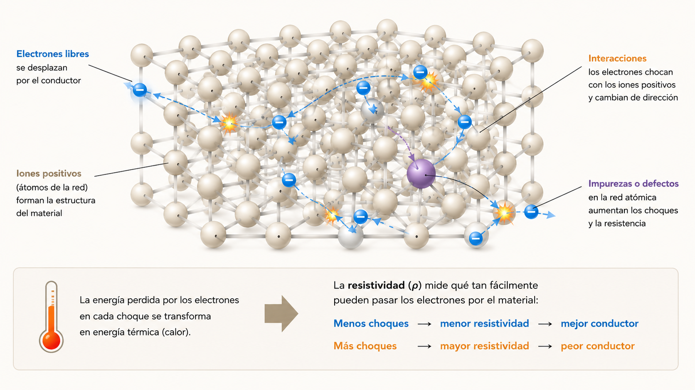

# AGENTS.md

## Propósito del proyecto

Este repositorio contiene apuntes/clases web de Física para secundaria, con enfoque didáctico, visual y profesional.

Cada nueva clase debe generarse tomando como referencia la estructura del archivo HTML existente sobre corriente eléctrica:

- documento en HTML completo;
- idioma español rioplatense;
- estilo visual tipo apunte impreso;
- uso de MathJax para fórmulas;
- secciones numeradas;
- ejemplos resueltos;
- actividades para estudiantes;
- imágenes dentro de `assets/`;
- diseño responsive;
- preparación para impresión en A4.

El objetivo es que cada clase pueda publicarse como una página web educativa y también imprimirse como material de estudio.

---

## Seguridad y límites de ejecución

Este proyecto tiene fines educativos, pero Codex debe trabajar con criterios de seguridad estrictos.

Reglas generales:

- No ejecutar comandos destructivos sin autorización explícita del usuario.
- No usar modo de acceso total, modo sin restricciones o configuraciones equivalentes salvo pedido explícito.
- No modificar archivos fuera del repositorio activo.
- No acceder a carpetas personales del sistema, descargas, escritorio u otras rutas externas al proyecto.
- No leer, copiar ni mostrar secretos, tokens, claves, cookies, credenciales o archivos de configuración sensibles.
- No crear, modificar ni usar archivos `.env` con credenciales reales.
- No subir archivos, imágenes, claves ni contenido del proyecto a servicios externos sin autorización.
- No instalar paquetes, extensiones o dependencias nuevas sin justificar para qué sirven.
- No ejecutar scripts descargados de internet.
- No activar acceso de red si la tarea puede resolverse localmente.
- No usar APIs pagas ni servicios externos que puedan generar costos.
- No borrar archivos, carpetas, ramas de Git o historial sin autorización explícita.
- No hacer `git push --force`.
- No ejecutar comandos como `rm -rf`, `del /s`, `format`, limpieza masiva o equivalentes sin autorización explícita.
- No cambiar permisos del sistema operativo.
- No abrir puertos, servidores públicos ni túneles externos sin autorización.
- No publicar el sitio ni desplegar cambios sin confirmación del usuario.
- No hacer `git push` sin autorización explícita del usuario.

Comandos de riesgo que requieren autorización explícita:

```bash
rm -rf
del /s
rmdir /s
git reset --hard
git clean -fd
git push
git push --force
npm install
pip install
curl ... | bash
wget ... | bash
chmod -R
```

En Windows, también requieren autorización explícita:

```powershell
Remove-Item -Recurse -Force
Set-ExecutionPolicy
Invoke-WebRequest ... | Invoke-Expression
iwr ... | iex
```

Regla de trabajo seguro:

1. Revisar primero la estructura del proyecto.
2. Hacer cambios mínimos y localizados.
3. Explicar qué archivos se van a modificar.
4. Modificar solo lo necesario.
5. Verificar que no se rompió el HTML, CSS, MathJax ni las rutas de imágenes.
6. Mostrar un resumen final de cambios.
7. Indicar si queda algo pendiente.

Si Codex detecta una acción riesgosa, debe detenerse y escribir:

```txt
PENDIENTE DE AUTORIZACIÓN: esta acción puede modificar, borrar, publicar, instalar dependencias, usar red externa o generar costos. Confirmar antes de continuar.
```

---

## Privacidad y datos sensibles

Codex no debe incluir en los apuntes, commits o archivos del proyecto:

- datos personales reales de estudiantes;
- listas de alumnos;
- calificaciones;
- direcciones;
- teléfonos;
- correos privados;
- documentos de identidad;
- capturas con información sensible;
- claves de API;
- tokens de GitHub, Vercel, OpenAI u otros servicios;
- cookies o sesiones del navegador.

Si el usuario proporciona material con datos sensibles, Codex debe sugerir anonimizarlo antes de incorporarlo.

Ejemplos correctos:

```txt
Estudiante A
Grupo 1
Curso 4° año
```

Ejemplos incorrectos:

```txt
Nombre completo de estudiante
DNI
Dirección personal
Correo privado
Token de API
```

---

## Uso seguro de extensiones y herramientas externas

Si se usa una extensión de Chrome u otra herramienta externa, debe ser únicamente con autorización explícita del usuario.

Reglas:

- No instalar extensiones nuevas sin autorización.
- No conceder permisos amplios sin explicar el motivo.
- No usar extensiones que lean páginas, cookies, sesiones o datos personales sin autorización.
- No usar extensiones para acceder a cuentas personales del usuario.
- No usar extensiones para subir archivos del proyecto a servicios externos sin autorización.
- No usar herramientas externas que generen costos.
- No automatizar acciones en sitios web personales o cuentas del usuario sin confirmación.
- No copiar información sensible desde el navegador hacia el proyecto.

Si una herramienta externa es necesaria, Codex debe explicar:

- qué herramienta necesita;
- para qué la usaría;
- qué archivos o datos tocaría;
- si usa red externa;
- si puede generar costos;
- qué alternativa local existe.

---

## Seguridad en imágenes y recursos externos

Al trabajar con imágenes:

- No descargar imágenes desde sitios desconocidos sin autorización.
- No usar imágenes con derechos dudosos si el material será publicado.
- Preferir imágenes generadas por el usuario en ChatGPT Plus o recursos propios.
- No subir imágenes de estudiantes o personas reales a servicios externos sin autorización.
- No usar rostros de menores en materiales públicos sin permiso correspondiente.
- No incluir metadatos sensibles si se procesan imágenes.
- Guardar assets únicamente dentro de `assets/`.

Si falta una imagen, dejar:

```html
<!-- PENDIENTE: generar o agregar imagen segura en assets/nombre-imagen.png -->
```

---

## Seguridad antes de deploy

Antes de publicar en GitHub, Vercel u otro servicio, revisar:

- [ ] No hay claves ni tokens en el código.
- [ ] No hay `.env` con datos reales.
- [ ] No hay información personal de estudiantes.
- [ ] No hay imágenes sensibles.
- [ ] Todas las rutas son relativas.
- [ ] El sitio funciona localmente.
- [ ] El usuario autorizó el deploy o el push.
- [ ] No se usó `git push --force`.

---

## Estilo general de las clases

Mantener una estética similar al apunte base:

- fondo tipo papel/cuaderno;
- diseño centrado en una hoja principal;
- tipografía serif para el contenido;
- colores sobrios con acentos dorados y azul oscuro;
- cajas destacadas para definiciones, ejemplos y notas docentes;
- tablas claras;
- fórmulas destacadas en cajas visuales;
- imágenes con `figure`, `img` y `figcaption`;
- actividades con espacios para resolver;
- footer con sugerencia didáctica.

No reemplazar la identidad visual del proyecto salvo que el usuario lo pida explícitamente.

---

## Estructura recomendada para cada clase

Cada nueva clase debe seguir una estructura parecida a esta:

1. Encabezado principal
   - materia o proyecto;
   - título de la clase;
   - subtítulo breve;
   - datos del curso, tema y unidades si corresponde;
   - imagen o retrato científico opcional.

2. Idea inicial
   - explicación intuitiva;
   - analogía cotidiana;
   - definición breve.

3. Desarrollo conceptual
   - explicación progresiva;
   - conexión con conceptos previos;
   - vocabulario científico claro;
   - ejemplos físicos concretos.

4. Modelo o representación
   - esquema del fenómeno;
   - imagen o diagrama;
   - lectura guiada del modelo.

5. Fórmula fundamental
   - caja con fórmula central;
   - explicación de cada variable;
   - unidades.

6. Sistema de unidades
   - tabla con magnitudes, símbolos, unidades SI y relaciones importantes.

7. Despejes, relaciones entre variables o análisis proporcional
   - mostrar fórmulas reorganizadas solo si corresponde;
   - advertir sobre unidades;
   - incluir nota docente;
   - si el tema todavía no requiere despejes algebraicos, usar análisis cualitativo.

8. Ejemplo resuelto
   - problema;
   - datos;
   - fórmula;
   - reemplazo;
   - resultado con unidad;
   - interpretación física.

9. Actividades
   - entre 8 y 10 ejercicios;
   - dificultad progresiva;
   - incluir al menos una actividad con tabla o gráfico;
   - dejar líneas o espacios de trabajo.

10. Preguntas para pensar
   - preguntas conceptuales;
   - comparación entre fenómenos;
   - errores comunes o ideas para discutir.

11. Footer
   - sugerencia de resolución o recomendación docente.

---

## Reglas de contenido didáctico

Al generar una clase:

- explicar de lo simple a lo complejo;
- usar analogías, pero aclarar sus límites;
- evitar definiciones demasiado abstractas al inicio;
- conectar las fórmulas con fenómenos observables;
- incluir unidades en todos los ejemplos numéricos;
- evitar resultados sin interpretación;
- no usar fórmulas sin explicar qué representa cada símbolo;
- incluir preguntas que obliguen a justificar, no solo calcular;
- cuidar que las actividades puedan resolverse con lo explicado en la clase;
- evitar adelantar temas que todavía no fueron trabajados.

Cuando haya gráficos, explicar:

- qué representa cada eje;
- qué significa cada punto;
- qué representa la pendiente si corresponde;
- cómo se conecta el gráfico con la fórmula.

---

## Reglas de física y matemática

Mantener rigor físico:

- usar Sistema Internacional siempre que sea posible;
- aclarar conversiones de unidades;
- no confundir magnitudes distintas;
- distinguir variable, unidad y símbolo;
- revisar signos, direcciones y sentido físico;
- verificar que los ejemplos numéricos sean coherentes;
- no inventar datos históricos dudosos;
- si hay incertidumbre, marcar como `PENDIENTE` en vez de afirmar.

Para fórmulas:

- usar MathJax con delimitadores:
  - inline: `\( ... \)`
  - display: `\[ ... \]`
- no usar imágenes para fórmulas simples;
- mantener consistencia de símbolos en toda la clase.

---

## Secuencia didáctica de electricidad

Respetar la progresión conceptual de las clases.

Orden sugerido:

1. Corriente eléctrica:
   - carga por unidad de tiempo;
   - \(I=\frac{q}{t}\);
   - electrones libres;
   - flujo de carga;
   - lectura de gráficos \(q(t)\).

2. Resistencia eléctrica:
   - oposición al movimiento de cargas;
   - variables geométricas y materiales;
   - longitud \(L\);
   - área transversal \(A\);
   - resistividad \(\rho\);
   - fórmula \(R=\rho \frac{L}{A}\);
   - superconductividad como digresión.

3. Ley de Ohm:
   - relación entre tensión, corriente y resistencia;
   - \(V=I\cdot R\);
   - \(R=\frac{V}{I}\);
   - \(I=\frac{V}{R}\);
   - gráficos \(V(I)\).

Importante:

- En la clase de resistencia eléctrica no desarrollar todavía la Ley de Ohm.
- No usar \(V=I\cdot R\), \(R=\frac{V}{I}\) ni \(I=\frac{V}{R}\) antes de la clase específica de Ley de Ohm.
- En resistencia eléctrica, usar como fórmula central:

\[
R = \rho \frac{L}{A}
\]

---

## Generación de imágenes educativas sin API

Para este proyecto, evitar el uso de OpenAI Images API, GPT Image API, DALL·E API u otras APIs pagas para generar imágenes, salvo autorización explícita del usuario.

Preferir la generación de imágenes desde ChatGPT Plus, usando la interfaz normal de ChatGPT o herramientas disponibles dentro de la suscripción del usuario.

Codex debe:

- No pedir ni asumir una `OPENAI_API_KEY` para generar imágenes.
- No crear scripts que consuman API de imágenes sin autorización.
- No agregar dependencias orientadas a llamadas pagas de API.
- No consumir servicios pagos de terceros sin autorización explícita.
- Si necesita una imagen, debe dejar preparado el prompt educativo para que el usuario la genere desde ChatGPT Plus.
- Guardar o indicar que la imagen final debe colocarse en `assets/`.
- Mantener nombres simples, descriptivos, sin espacios ni acentos.
- Incluir siempre `alt` descriptivo y `figcaption` didáctico en el HTML.
- Si la imagen todavía no existe, dejar un comentario `PENDIENTE`.
- No afirmar que una imagen fue generada si el archivo no existe realmente en el proyecto.
- No inventar rutas de imágenes.
- No usar imágenes externas como recurso central si pueden romperse o desaparecer.

Ejemplo cuando falta una imagen:

```html
<!-- PENDIENTE: generar esta imagen desde ChatGPT Plus y guardarla como assets/resistencia-conductor.png -->
```

Ejemplo de uso correcto:

```html
<figure class="figure">
  
  <figcaption>
    Modelo microscópico de la resistencia: los electrones libres se desplazan por el conductor e interactúan con la red atómica del material.
  </figcaption>
</figure>
```

Flujo esperado para imágenes:

1. Codex detecta que falta una imagen didáctica.
2. Codex redacta un prompt claro para generar esa imagen.
3. El usuario genera la imagen desde ChatGPT Plus.
4. El usuario guarda la imagen en `assets/`.
5. Codex referencia la imagen en el HTML con ruta relativa.

---

## Prompts sugeridos para imágenes de resistencia eléctrica

### Modelo microscópico de resistencia eléctrica

Crear una infografía educativa en español sobre resistencia eléctrica en un conductor metálico. Mostrar un conductor ampliado, electrones libres moviéndose de forma ordenada, red de iones positivos del metal, interacciones con la red atómica y conversión parcial de energía eléctrica en energía térmica. Incluir etiquetas: “electrones libres”, “red metálica”, “interacciones”, “resistencia eléctrica”. Estilo claro, científico, escolar, con fondo tipo papel y colores sobrios.

Nombre sugerido:

```txt
assets/resistencia-conductor.png
```

### Longitud del conductor

Crear una infografía comparativa en español con dos conductores del mismo material y misma área transversal: uno corto y uno largo. Mostrar que el conductor más largo presenta mayor resistencia. Incluir etiquetas: “menor longitud”, “mayor longitud”, “menor resistencia”, “mayor resistencia”, “\(L\) aumenta → \(R\) aumenta”. Estilo educativo, limpio y coherente con un apunte de física secundaria.

Nombre sugerido:

```txt
assets/conductor-largo-corto.png
```

### Área transversal

Crear una infografía comparativa en español con dos conductores del mismo material y misma longitud: uno fino y uno grueso. Mostrar que el conductor con mayor área transversal presenta menor resistencia. Incluir etiquetas: “menor área”, “mayor área”, “mayor resistencia”, “menor resistencia”, “\(A\) aumenta → \(R\) disminuye”. Estilo escolar, claro, con flechas y cortes transversales visibles.

Nombre sugerido:

```txt
assets/area-transversal.png
```

### Resistividad de materiales

Crear una infografía educativa en español que compare materiales según su resistividad relativa: cobre, aluminio, nicrom y plástico. Mostrar una escala visual desde “baja resistividad” hasta “alta resistividad”. Indicar que la resistividad es una propiedad del material. Estilo claro, científico, apto para secundaria.

Nombre sugerido:

```txt
assets/resistividad-materiales.png
```

### Superconductividad

Crear una infografía educativa en español sobre superconductividad a bajas temperaturas. Mostrar un material enfriado cerca del cero absoluto, una curva resistencia-temperatura donde la resistencia cae abruptamente a cero por debajo de la temperatura crítica, y una referencia visual a Heike Kamerlingh Onnes y el mercurio. Incluir etiquetas: “temperatura crítica”, “resistencia cero”, “superconductividad”, “bajas temperaturas”. Estilo científico, elegante y didáctico.

Nombre sugerido:

```txt
assets/superconductividad.png
```

---

## Reglas de HTML

Cada clase debe ser un archivo HTML autónomo, salvo imágenes ubicadas en `assets/`.

Estructura mínima:

```html
<!doctype html>
<html lang="es">
<head>
  <meta charset="utf-8">
  <meta name="viewport" content="width=device-width, initial-scale=1">
  <title>...</title>

  <script>
    window.MathJax = {
      tex: {
        inlineMath: [["\\(", "\\)"]],
        displayMath: [["\\[", "\\]"]]
      }
    };
  </script>
  <script defer src="https://cdn.jsdelivr.net/npm/mathjax@3/es5/tex-chtml.js"></script>

  <style>
    /* CSS interno */
  </style>
</head>
<body>
  <main>
    <article class="page">
      ...
    </article>
  </main>
</body>
</html>
```

No dividir CSS o JavaScript en archivos externos salvo que el usuario lo pida.

---

## Reglas de CSS

Mantener el estilo base:

- variables CSS en `:root`;
- `box-sizing: border-box`;
- diseño responsive;
- soporte para impresión con `@media print`;
- usar clases reutilizables:
  - `.page`
  - `.doc-header`
  - `.eyebrow`
  - `.subtitle`
  - `.meta`
  - `.definition`
  - `.example`
  - `.teacher-note`
  - `.formula-box`
  - `.formula`
  - `.figure`
  - `.exercises`
  - `.work-line`

No eliminar reglas responsive ni reglas de impresión.

Cuando se agreguen nuevas clases CSS:

- usar nombres descriptivos;
- evitar estilos duplicados;
- mantener coherencia con la paleta existente;
- no agregar frameworks externos sin autorización.

---

## Imágenes y assets

Las imágenes deben ubicarse en:

```txt
assets/
```

Usar rutas relativas:

```html

```

Reglas para imágenes:

- siempre incluir `alt`;
- siempre usar `figcaption`;
- no usar rutas absolutas;
- no depender de imágenes externas para elementos importantes;
- verificar que el nombre del archivo coincida exactamente con el usado en HTML;
- evitar espacios y acentos en nombres de archivo;
- no reemplazar imágenes existentes por otras generadas sin autorización del usuario.

Ejemplos correctos:

```txt
assets/electrones.png
assets/grafico.png
assets/neurona.png
assets/Ampere.jpg
assets/resistencia-conductor.png
assets/conductor-largo-corto.png
assets/area-transversal.png
assets/resistividad-materiales.png
assets/superconductividad.png
```

---

## Estructura de actividades

Las actividades deben incluir:

- ejercicios numéricos;
- ejercicios conceptuales;
- lectura de gráficos o tablas;
- preguntas de comparación;
- espacios de resolución.

Formato sugerido:

```html
<ol class="exercises">
  <li>Enunciado del ejercicio.<span class="work-line"></span></li>
</ol>
```

Para ejercicios resueltos, usar:

```html
<div class="example">
  <p><strong>Problema:</strong> ...</p>
  <p><strong>Datos:</strong> ...</p>
  <p><strong>Fórmula:</strong> ...</p>
  <p><strong>Reemplazo:</strong> ...</p>
  <p><strong>Resultado:</strong> ...</p>
  <p><strong>Interpretación:</strong> ...</p>
</div>
```

---

## Convenciones para nuevas clases

Al crear una nueva clase, usar nombres de archivo simples:

```txt
corriente-electrica.html
resistencia-electrica.html
ley-de-ohm.html
potencia-electrica.html
energia-electrica.html
circuitos-serie-paralelo.html
```

No usar espacios, mayúsculas innecesarias ni acentos en nombres de archivo.

El archivo principal del sitio debe llamarse:

```txt
index.html
```

---

## Checklist antes de terminar una clase

Antes de finalizar, revisar:

- [ ] El HTML abre correctamente.
- [ ] El título coincide con el tema.
- [ ] MathJax renderiza las fórmulas.
- [ ] Las imágenes existen en `assets/` o están marcadas como `PENDIENTE`.
- [ ] Todas las imágenes tienen `alt`.
- [ ] Todas las imágenes tienen `figcaption`.
- [ ] Las secciones están numeradas.
- [ ] Hay ejemplo resuelto.
- [ ] Hay actividades.
- [ ] Hay preguntas para pensar.
- [ ] Las unidades son correctas.
- [ ] El diseño funciona en celular.
- [ ] El diseño puede imprimirse.
- [ ] No se rompió el estilo visual del proyecto.
- [ ] No se usaron APIs pagas de imágenes sin autorización.
- [ ] Si la clase necesita imágenes nuevas, quedaron prompts claros para generarlas desde ChatGPT Plus.
- [ ] No hay datos sensibles ni credenciales en el proyecto.
- [ ] No se ejecutaron comandos destructivos.
- [ ] No se instalaron dependencias nuevas sin autorización.
- [ ] No se usaron servicios externos pagos.
- [ ] No se publicó ni desplegó sin confirmación del usuario.

---

## Reglas para modificar clases existentes

Cuando se edite una clase ya creada:

- hacer cambios mínimos y precisos;
- no reescribir todo el archivo si solo se pidió una corrección;
- no eliminar secciones funcionales;
- no cambiar la estética general sin permiso;
- preservar imágenes y rutas existentes;
- no romper MathJax;
- no borrar actividades salvo pedido explícito;
- no reemplazar imágenes existentes por otras generadas sin autorización del usuario;
- no ejecutar comandos destructivos o de limpieza masiva sin autorización explícita;
- no tocar archivos fuera del repositorio;
- no usar red externa, APIs o extensiones sin autorización;
- no incluir datos reales de estudiantes o credenciales;
- si algo no está claro, agregar `PENDIENTE:` con una nota breve.

---

## Política de actualización automática del AGENTS.md

Codex puede actualizar este archivo solo para registrar información útil y confirmada del proyecto.

Permitido:

- agregar comandos descubiertos;
- registrar errores frecuentes;
- agregar convenciones nuevas confirmadas por el usuario;
- agregar checklist de deploy;
- registrar estructura real del proyecto;
- registrar prompts de imágenes aprobados por el usuario;
- registrar decisiones didácticas confirmadas;
- registrar reglas de seguridad confirmadas por el usuario.

No permitido:

- borrar reglas existentes sin autorización;
- cambiar el estilo general del proyecto;
- inventar workflows no probados;
- agregar dependencias no usadas;
- modificar reglas centrales sin justificación;
- agregar uso de APIs pagas sin autorización explícita;
- debilitar reglas de seguridad sin autorización explícita.

Si hay duda, agregar:

```md
PENDIENTE: revisar con el usuario antes de aplicar esta regla.
```

---

## Comandos frecuentes

Usar estos comandos según corresponda:

```bash
git status
git add .
git commit -m "Actualiza clase"
```

`git push` solo debe ejecutarse con autorización explícita del usuario.

Para revisar el proyecto localmente, abrir el archivo HTML en navegador.

Si el proyecto usa Vercel, recordar:

- debe existir `index.html` si es un sitio estático principal;
- las rutas a imágenes deben ser relativas;
- los archivos dentro de `assets/` deben estar versionados en Git;
- después de cambios, hacer commit;
- hacer push o deploy solo cuando el usuario lo autorice.

---

## Estilo de respuesta esperado de Codex

Cuando Codex explique cambios realizados, responder de forma breve y clara:

- qué archivo modificó;
- qué se agregó;
- qué se corrigió;
- qué falta revisar;
- si hay imágenes faltantes;
- si hay prompts listos para generar imágenes;
- si hay riesgos de seguridad detectados;
- si el proyecto está listo para revisión local;
- si falta autorización para push o deploy.

No escribir explicaciones largas salvo que el usuario lo pida.

---

## Identidad del material

Cuando corresponda, mantener la autoría:

```txt
Sistemas Multi Física - Profesor Javier Pereyra
```

El tono debe ser profesional, claro, didáctico y orientado a estudiantes de secundaria.